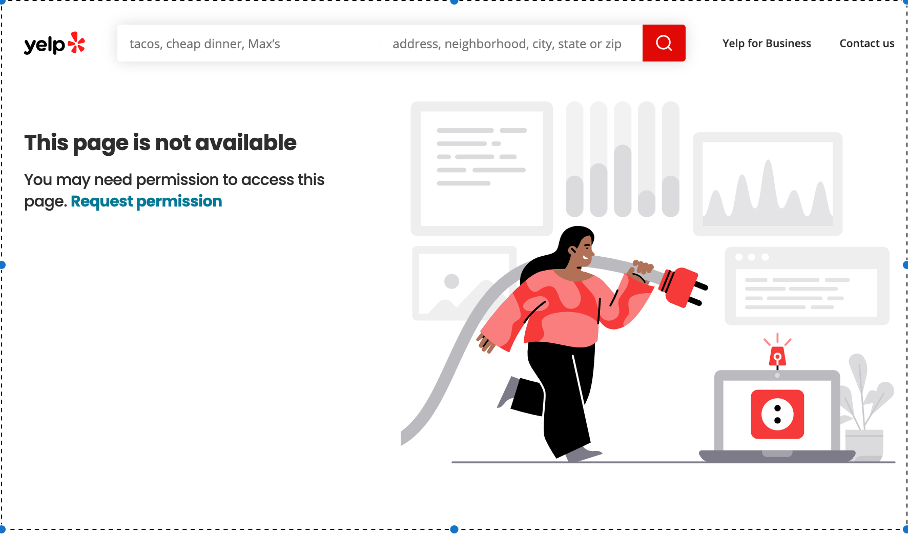

## Pyscrelp
**A Python module to scrape Yelp reviews with no authentication required.**

By [@cmoy11](https://github.com/cmoy11)

This code was origianlly developed in collaboration with the [Race and Data Justice Lab](https://www.radjusticelab.com/) and Dr. Matthew Bui at the [University of Michigan School of Information](https://www.si.umich.edu/). I have since repurposed this code for simple Yelp review scraping! Input a list of Yelp aliases (more on that later) and receive comprehensive csv files containing businesses' review data (including raw text, dates, and star rating).

**Installation**

```pip install -i https://test.pypi.org/simple/ pyscrelp==0.0.5```

**Requirements**

Pyscrelp relies on the following packages:

    - BeautifulSoup
    - requests

**Usage**

```python
import pyscrelp as pyscr
```    

To generate csv files for a list of businesses:
```python
pyscr.write_review_files(['green-dot-stables-detroit-2', 'brew-detroit-detroit'])
```
*Note:*

write_review_files() takes a list of Yelp aliases as its only parameter and does not return a value. CSV files are generated and non-valid businesses are printed in the terminal.

*Additional Note:*

CSV files are only written after ALL the reviews are collected. Make sure you have enough time to scrape all the restaurants listed before running or you will lose your progress. 

Recommended implementation:

```python
aliases = ['green-dot-stables-detroit-2', 'brew-detroit-detroit']

for alias in aliases:
    pyscr.write_review_files([alias])
```

*What is a Yelp alias?*

The Yelp alias is the unique tag following "https://www.yelp.com/biz/". It can be identified here "https://www.yelp.com/biz/brew-detroit-detroit" as "brew-detroit-detroit".

*Why Yelp aliases?*

The Yelp aliases are conveniently generated by the [Yelp Fusion  API](https://www.yelp.com/developers/documentation/v3/get_started). I also offer another function for basic Yelp alias generation.

To generate a list of Yelp aliases from a list of businesses and a city:
```python
pyscr.hyphenate(['Green Dot Stables', 'Brew Detroit'], 'detroit')
```
*Note:* 

Accepts a list of businesses and a city (please hyphenate multile word cities ~ los-angeles, st-paul). This is **not** 100% accurate, but rather a quick method for generating the most likely alias for businesses. The only guaranteed way to find Yelp aliases is manually via [yelp.com](yelp.com) or using the [Yelp Fusion  API](https://www.yelp.com/developers/documentation/v3/get_started). Be sure to check the not-valid print statement in the terminal if you choose to use the hyphenate function.

**Troubleshooting**

Rate limiting continues to be an issue. I have time.sleep()s scattered throughout the program to try and mitigate this, but if you are scraping hundreds of thousands of Yelp reviews like I have, you will likely run into issues with the Yelp server. Here are some helpful tips! 

The first roadblock you will likely hit is the recaptcha. If your code stops working all of the sudden, try going to yelp.com. If you see the recaptcha, proceed through the recaptcha and continue scraping!

If you see this on the other hand:

You are out of luck :/ and you'll have to wait until you are unblocked.

**Disclaimer**

Yelp continues to change the structure of their sites, so this program may suddenly stop working. I try to stay on top of updates, but feel free to shoot me a message if you are having difficulties.